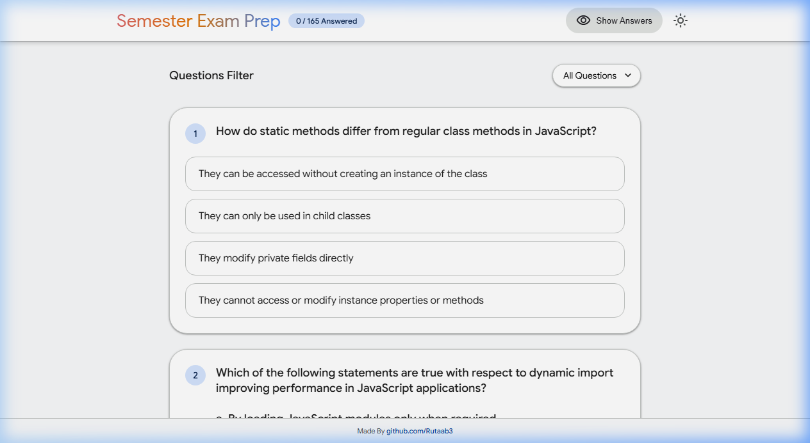
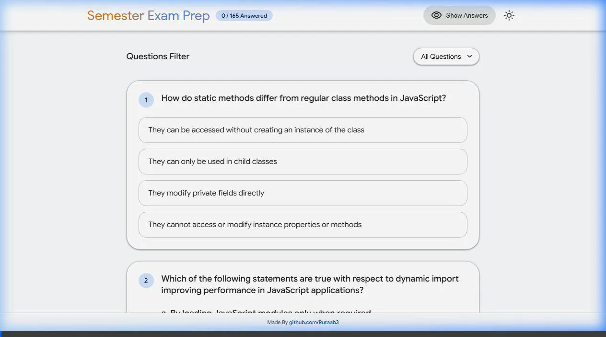

# 🎓 Semester Exam Prep — Quiz App

A professional, high-fidelity quiz application built with **Google's Material Design 3 (Material You)**. Designed to provide a native-feeling experience similar to Google Gemini and Google Search.

## 📺 Feature Demonstration


## ✨ Features

- **🎨 Native Google Aesthetics**: Replicated Gemini-style shimmer animations, Google Sans typography, and Material You color tokens.
- **🌗 Material You Theming**: Full support for dynamic Light and Dark modes with automatic persistence.
- **📱 Mobile Optimized**: Fully responsive layout with a stacked navbar and compact UI for small screens.
- **⚡ Interactive Feedback**: High-fidelity ripple effects and smooth state transitions for quiz options.
- **🛠️ Quiz Management**:
  - 165+ high-quality questions preserved.
  - Pagination (10, 20, 30 questions per page).
  - Real-time score tracking and progress monitoring.
  - Integrated answer visibility toggle.
- **🚀 Performance**: Single-file architecture for instant loading and offline capability.

## 🛠️ Tech Stack

- **Frontend**: HTML5, Vanilla JavaScript
- **Styling**: Custom CSS3 with Material Design 3 tokens (No heavy frameworks)
- **Icons**: Material Symbols Rounded
- **Typography**: Google Sans, Roboto

## 🚀 Getting Started

1. **Clone the repository**:
   ```bash
   git clone https://github.com/Rutaab3/MCQS.git
   ```
2. **Open the app**:
   Simply open `index.html` in any modern web browser.

## 📱 Mobile Preview

The application is optimized for mobile touch targets, ensuring that all interactive elements are easy to use on small screens.

---
Made By [Rutaab3](https://github.com/Rutaab3)
